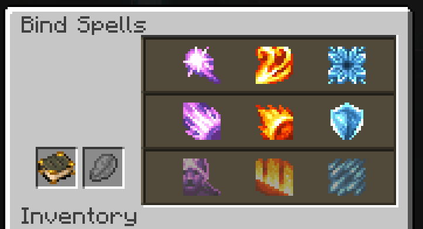

<div align="center">

<a href=""></a>
<a href=""></a>
<a href="">[](https://discord.gg/KN9b3pjFTM)</a>

</div>

## 🪄️ Features

Data driven API
- 🗡️ Spells can be assigned to any weapon (data driven with automatic weapon compatibility)
- 🔮 Spells deal damage based on [Spell Power](https://github.com/ZsoltMolnarrr/SpellPower) entity attributes
- ✍️ Spells defined in JSON format with hot-reloading and network synchronization
- 📦 Spell Container System with proxy mode, equipment slots, and dynamic spell resolution
- 🔄 Universal pattern matching for tags, regex, and exact matches across all spell properties
- 🛠️ Programmatic spell generation with SpellBuilder and SpellGenerator for mod developers
- ⚙️ Spells have a comprehensive set of mechanical behaviours:
    - **Spell Types**: Active (casted), Passive (triggered), Modifier (spell-modifying)
    - **Cast Modes**: Instant, charged, channeled, with configurable haste effects
    - **Trigger System**: 14+ trigger types (melee, arrow, spell, damage, evasion, roll, etc.) with conditional logic
    - **Targeting**: Aim, Beam, Area, Caster, None, FromTrigger - with caps, conditions, and health-based limits
    - **Delivery**: Direct, Projectile, Meteor, Cloud, ShootArrow, StashEffect, Custom - with delays and multi-placement
    - **Projectile Features**: Homing, ricochet, bounce, pierce, chain reactions, divergence, custom hitboxes
    - **Impact Actions**: Damage, Heal, StatusEffect, Fire, Teleport, Spawn, Cooldown, Aggro, Custom
    - **Conditional Logic**: Target modifiers, impact filters, chance-based execution, entity type conditions
    - **Cost System**: Exhaust, items/runes, cooldowns, durability, status effect consumption, with batching
    - **Equipment Sets**: Set bonuses providing spells, attributes, and special abilities

Fancy audio and visuals
- 🔈 Advanced sound system: casting start/loop, release, impact, travel sounds with randomization
- ✨ Sophisticated particle system with shapes, entity following, scaling, and custom magical particles
- 🎨 Custom Item/Block models for projectiles, status effects, and spell clouds with BlockBench support
- 🤸 Player animations at all spell stages with pitch control and ranged weapon animation support
- 💡 Dynamic lighting integration (LambDynamicLights) for magical illumination
- 🌈 Customizable beam rendering with colors, textures, width, and flow effects
- 📍 Area effect visualization with ground indicators and range-scaled particles

In game features
- 🔧 Spell selection and casting visible on HUD (fully player configurable)
- 😌 QoL features: automatic spell cast release, client prediction, smart targeting
- ⛓️ Spell Binding Table for adding spells to weapons and creating spell books
- 📜 Spell Scroll system with creative tab generation and dungeon loot integration
- 🎒 Equipment integration: Spell books, trinket slots (Trinkets/Accessories), automatic weapon detection
- ⚡ Spell Infinity enchantment with configurable item tag support
- 🎮 Commands: `/spell_cooldowns` for server administration and debugging
- 💰 Advanced loot system with `spell_bind_randomly` function for dynamic spell assignment

Developer & Mod Integration
- 🔌 Extensive mod compatibility: Better Combat, Combat Roll, FTB Teams, Shoulder Surfing, and more
- 📊 Comprehensive event system for spell casting, healing, and projectile lifecycle
- 🏗️ Custom handler registration for delivery methods and impact actions
- 🎯 Entity predicate system for complex targeting conditions
- 🔧 Performance optimizations: batching, scheduling, client-side prediction
- 📝 Data generation framework for programmatic spell creation and validation
- 🌐 Multi-platform support (Fabric & NeoForge) with unified API


## ⌨️ Game technical features

### Spells

Spells functionality allows creating custom spells, with various mechanics.

Primary types:
- Active - player interactable (casted) spells, performing wide set of impacts
- Passive - non-interactable spells, triggered by various events, performing wide set of impacts
- Modifier - non-interactable spells, modifying existing spells in pre-defined ways

Fully data driven, (stored in a DynamicRegistry).
- Data file example path: `resources/data/MOD_ID/spells/SPELL_ID.json`
- Assigned to items using Spell Assignments type (see below)

Data type: `Spell` object (see [Spell](common/src/main/java/net/spell_engine/api/spell/Spell.java) for details)

### Item Components

#### Spell Container

Defines spell casting capability for the item. Including:
- spell book access
- contained spells
- binding pool (spell tag), the set of spells that can be bound to the item
- maximum number of spells it can hold

Data type: `SpellContainer` object (see [Spell Container](common/src/main/java/net/spell_engine/api/spell/container/SpellContainer.java) for details)

#### Spell Choice

The spell choice component defines a set of spells available for the item. 

Upon first use, player can choose one of the spells from the set to be bound to the item. The chosen spell will be bound to the item, removing the spell choice component from the item, and adding the chosen spell to the spell container of the item. Note: this means items also need to have a valid spell container assigned (otherwise the chosen has nowhere to be placed).

Designed for weapons, meant to be used by multiple classes. For example: Wizard Staff that can be used by any of the Wizard specializations.

Data type: `SpellChoice` object (see [Spell Choice](common/src/main/java/net/spell_engine/api/spell/container/SpellChoice.java) for details)

Assigning a spell choice with a spell container to an item, using a game command:
```
/give @p minecraft:wooden_sword[spell_engine:spell_choice={"pool":"wizards:weapon/wizard_staff"}, spell_engine:spell_container={access:MAGIC, spell_ids: [] }]
```

#### Equipment Set

Defines equipment set assigned to the item.

See [Equipment sets](#equipment-sets) section below for details.

Data type: `Identifier` (points to equipment set id)

### Spell assignments

Spell containers can be assigned to an item in multiple ways. These methods have a priority order, Spell Engine will resolve the spell container from the highest priority method available.
1. ItemStack (meta data) component
2. Item default component
3. Spell Assignment data file
4. Automatic (fallback) container assignment done by Spell Engine

#### Assignment with ItemStack (meta data) component

Assigning a spell container to an item, using a game command:
```
/give @p minecraft:wooden_sword[spell_engine:spell_container={access:MAGIC, spell_ids: ["wizards:fireball"] }]
```

#### Assignment with Item default component

Most items are assigned their default spell container using this method.

This method is primarily meant for mod developers, to hard-code the default spell container to their custom items.

Example item definition with hard-coded default component (java code):
```java
public static final Weapon.Entry noviceWand = add(Weapons.damageWand(
                NAMESPACE, "wand_novice",
                Equipment.Tier.TIER_0, () -> Ingredient.ofItems(Items.STICK),
                List.of(SpellSchools.FIRE.id))
        .spellContainer(SpellContainers.forMagicWeapon().withSpell("wizards:scorch"))
);
```

Some third party tools offer ways to override this, in a data driven way.
- [Default Components mod](https://modrinth.com/mod/default-components) (Fabric)
- [Defaulted mod](https://modrinth.com/mod/defaulted/) (Fabric & NeoForge)

#### Assignment with Spell Assignment Data File (Legacy)

Assigning a spell container to an item, using a data file. Fields are the same as the [Spell Container](#spell-container) component.

Example data file, located at `data/NAMESPACE/spell_assignments/ITEM_NAME.json`, allows casting from the equipped spell book (use `ARCHERY` for ranged weapons), has Frostbolt pre-bound, and arcane spells can be bound to it:
```json
{
  "access": "MAGIC",
  "spell_ids": [ "wizards:frostbolt" ],
  "pool": "wizards:arcane"
}
```

An empty data file (`{ }`) disables spell casting for the item, also preventing fallback assignment.

#### Fallback assignment

Configurable feature, automatically assigns spell containers to melee (sword, axe, mace, trident) and ranged (bow, crossbow) items, without any other assignment. Melee weapons receive their [weapon skill](#weapon-skills) based on weapon type tags `rpg_series:weapon_type/<type>`, or item name patterns (e.g. `greatsword`). Items tagged `#spell_engine:non_combat_tools` are skipped.

Config file: `config/spell_engine/weapon_fallback.json`

### Equipment sets

Equipment Sets functionality, allows creating item set bonuses.

Primary features:
- Equipment set bonuses can provide:
  - attributes modifiers
  - any kind of spells
- Supports any kind of equipment (weapons, armors, shields, trinkets...)

Fully data driven, (stored in a DynamicRegistry).

Equipment sets require a two-way association:
- Define the set with a data file
  - Referring all items part of the set (alongside the bonuses)
  - Example path: `resources/data/NAMESPACE/equipment_set/SET_NAME.json`
- Assign the set to items, using an item component
  - Example item with an equipment set: `/give @p minecraft:iron_boots[spell_engine:equipment_set="NAMESPACE:SET_NAME"]`

### Extra inventory slots

Fabric version 
- ships with Accessories and Trinkets support, only one set of the compatibility data files will be loaded, depending on which mod is present
- priority config available for when both are present: `config/spell_engine/fabric_compatibility.json`

NeoForge version
- only ships with Accessories mod compatibility

#### Trinkets integration

The following slots are implemented, using Trinkets mod:
- Spell Book slot `spell/book` (enabled by default)
- Spell Scroll slot `spell/scroll` (disabled by default)
- Quiver slot (in standalone group) `misc/quiver` (enabled by default)
- Quiver slot (in the `spell group`) `spell/quiver` (disabled by default)

#### Accessories integration

The following slots are implemented, using Accessories mod:
- Spell Book slot `spell/book` (enabled by default)
- Spell Scroll slot `spell/scroll` (disabled by default)
- Quiver slot `spell/quiver` (enabled by default)
- Spell Trinket slot `spell/trinket` (enabled by default)

### Tags for customization

Check out the various tags (for items, entities, spells) [here](common/src/main/java/net/spell_engine/api/tags).

### Commands

- `/spell_cooldowns` command (added in Spell Engine 1.5.1). Use to reset specific or all spell cooldowns of given players.

### Loot functions

- `spell_engine:spell_bind_randomly` (added in Spell Engine 1.6.0)
  - Binds one or more random spells to an item.
  - Parameters
    - `pool` Spell tag (optional): tag of spells to choose from
    - `tier` NumberProvider (optional): tier of spells to select from
    - `count` NumberProvider (optional): number of spells to bind
  - Examples use cases:
    - Spell scrolls with a random spells
    - Partially filled spell books
    - Vanilla (or third party weapons) with spell assignments
    - Equipment with additional spells

## 📦️ Game Content

This mod is primarily a library for developers, but it comes with few generic content, primarily to allow spell book creation and spell binding.

### Items

#### Spell Book

ID: `spell_engine:spell_book`

Spell books are items that can hold multiple spells. They are the primary source of spells for players.

Spell book variants are automatically generated (use the same underlying item), offered by
- the Spell Binding Table
- the Spell Engine Creative Tab

Fully data driven Spell Books
- Automatically generated for all spell tags located in the `tags/spell/spell_book/` folder (`<NAMESPACE>:spell_book/<TAG_NAME>`)
- Automatically assigned item model based on tag id: `<NAMESPACE>:models/item/spell_book/<TAG_NAME>.json`
- Automatically assigned custom name based on tag id, translation key: `item.<NAMESPACE>.spell_book/<TAG_NAME>`

**Creating spell books**
1. Create your spell book tag, by creating a JSON file at: `data/NAMESPACE/tags/spell/spell_book/BOOK_NAME.json`.
2. Add language resources the spell book:
  - `item.NAMESPACE.spell_book/BOOK_NAME`: "My Spell Book"
  - `item.NAMESPACE.spell_book/BOOK_NAME.spell_binding.description`: "A powerful spell book containing many spells." (shown in the Spell Binding Table)
3. Add custom item model for the spell book:
  - `assets/NAMESPACE/models/item/spell_book/BOOK_NAME.json`

Example - mixed Wizard spell book:
`data/example_namespace/tags/spell/spell_book/example_book.json`
```
{
  "values": [
    "wizards:arcane_missile",
    "wizards:arcane_beam",
    "wizards:arcane_blink",
    "wizards:fire_breath",
    "wizards:fire_meteor",
    "wizards:fire_wall",
    "wizards:frost_nova",
    "wizards:frost_shield",
    "wizards:frost_blizzard"
  ]
}
```
(Step 2 and 3 were skipped)

Result: 



**Giving spell books with commands**

A spell book variant is the `spell_engine:spell_book` item with a spell container whose `pool` is the spell book tag id (without `#`).
The model and name components are optional, without them the book uses the generic model and name.

```
/give @p spell_engine:spell_book[spell_engine:spell_container={pool:"wizards:spell_book/fire"},spell_engine:item_model="wizards:item/spell_book/fire",item_name='{"translate":"item.wizards.spell_book/fire"}']
```

Minimal form:
```
/give @p spell_engine:spell_book[spell_engine:spell_container={pool:"wizards:spell_book/fire"}]
```

**Disabling spell books**
1. Create a datapack, with an empty spell book tag for the spell book you want to disable.

#### Spell Scroll

ID: `spell_engine:spell_scroll`

Spell scrolls are items with one spell bound to them
- can be attached Spell Books those binding pool contains the spell of the scroll (using the Spell Binding Table)
- can be equipped into Spell Book slot (and Spell Scroll slot if enabled), to use standalone

The purpose of spell scrolls, is to allow players to collect spells from loot, instead of crafting them, similar to how enchanted books work compared to regular enchantments.

Fully data driven Spell Scrolls
- Automatically generated for all spells listed under tags located in `spell_scroll/` folder (`<NAMESPACE>:spell_scroll/<TAG_NAME>`)
- Automatically assigned item model based on tag id: `<NAMESPACE>:models/item/spell_scroll/<TAG_NAME>.json`
- Automatically assigned custom name based on tag id, translation key: `item.<NAMESPACE>.spell_scroll/<TAG_NAME>`

### Blocks

#### Spell Binding Table block

- ID: `spell_engine:spell_binding`
- Use it to create spell books, and bind spells to them

### Enchantments

#### Spell Infinity

- ID: `spell_engine:spell_infinity`
- Effect: negates spell cast rune cost 
- Applicable: for items under the item tag `spell_engine:enchantable/spell_infinity`

### Status Effects

Harmful status effects that spells can apply as impacts.

| Icon | Effect | ID | Description |
|---|---|---|---|
|  | Stun | `spell_engine:stun` | The target cannot move or act — attacking, using items and casting are all blocked. |
|  | Immobilize | `spell_engine:immobilize` | Roots the target in place (no movement or jumping), but it can still act. |
|  | Bleed | `spell_engine:bleed` | Lethal damage over time that scales with the target's movement — half of poison's damage while standing still, ramping up to double at full speed. |

### Weapon Skills

Built-in, class-agnostic melee weapon skills in the `rpg_series` namespace, ready to be assigned to any weapon (see [Spell assignments](#spell-assignments)). They cover spins, slams, lunges and thrown-weapon attacks.

| Icon | Skill | ID | Description |
|---|---|---|---|
|  | Whirlwind | `rpg_series:whirlwind` | Channeled — spin in place, dealing damage each second to all nearby enemies while held.<br>*Typically assigned to: double axes (war axes, great axes).* |
|  | Cleave | `rpg_series:cleave` | Instant — a single spin attack that strikes every nearby enemy at once.<br>*Typically assigned to: axes.* |
|  | Ground Slam | `rpg_series:ground_slam` | Charged — leap into the air and slam down, dealing damage in an area around the landing point.<br>*Typically assigned to: hammers (war hammers, mauls).* |
|  | Smash | `rpg_series:smash` | Charged — a heavy blow with strong knockback that disrupts the target, disabling its shield and item use.<br>*Typically assigned to: maces (and flails).* |
|  | Flurry | `rpg_series:flurry` | Channeled — unleash a rapid two-slash combo while carried forward with momentum.<br>*Typically assigned to: claymores (greatswords).* |
|  | Swift Strikes | `rpg_series:swift_strikes` | Instant — a quick twin-strike combo.<br>*Typically assigned to: swords (blades).* |
|  | Impale | `rpg_series:impale` | Charged — hurl your weapon forward like a spear, dealing damage and powerful knockback.<br>*Typically assigned to: spears.* |
|  | Fan of Knives | `rpg_series:fan_of_knives` | Instant — throw a spread of blades in a cone that bounce off terrain.<br>*Typically assigned to: daggers (knives).* |
|  | Thrust | `rpg_series:thrust` | Charged — lunge forward, striking every enemy along your path.<br>*Typically assigned to: glaives.* |
|  | Swipe | `rpg_series:swipe` | Instant — slide forward, striking every enemy along your path.<br>*Typically assigned to: sickles.* |

## 🏰 RPG Series Core

Spell Engine also hosts the shared foundation of the RPG Series content mods (Wizards, Paladins, Archers, Rogues, Arsenal, Armory, Jewelry, Relics...), under the `rpg_series` namespace ([`net.spell_engine.rpg_series`](common/src/main/java/net/spell_engine/rpg_series) package). Third party content can join in purely with data (item tags), or by using the API.

### Item tags

Defined in [`RPGSeriesItemTags`](common/src/main/java/net/spell_engine/rpg_series/tags/RPGSeriesItemTags.java).

| Tag | Purpose |
|---|---|
| `rpg_series:weapon_type/<type>` | Weapon category: `damage_staff`, `damage_wand`, `healing_staff`, `healing_wand`, `short_bow`, `long_bow`, `rapid_crossbow`, `heavy_crossbow`, `sword`, `claymore`, `mace`, `hammer`, `spear`, `dagger`, `sickle`, `double_axe`, `glaive`, `spell_blade`, `spell_scythe`, `shield` |
| `rpg_series:archetype/<role>_weapon` | Combat role, composed of the weapon type tags: `melee_damage`, `ranged_damage`, `magic_damage`, `defense`, `healing` |
| `rpg_series:armor_type/<type>` | Armor category: `melee`, `magic`, `archery` |
| `rpg_series:loot_tier/tier_<N>_<category>` | Items offered by loot injection. Category: `weapons`, `armors`, `accessories`, `relics`. Tier by quality: `0` wooden / stone, `1` iron, `2` diamond, `3` netherite, `4`+ end game and boss loot |
| `rpg_series:loot_theme/<theme>` | Themed loot, for matching structures: `golden_weapon`, `aether`, `dragon` |
| `rpg_series:loot_reference/<name>` | Vanilla gear and valuables (`tier_<N>_weapons`, `tier_<N>_armors`, `tier_<N>_treasures`, `golden_weapons`), used to recognize what an unknown loot table is worth. Extend these with third party gear of matching quality |
| `<namespace>:loot_affiliation/<book>` | Items relevant for the class of the spell book `<namespace>:spell_book/<book>`, see [class affiliation](#class-affiliation) |

### Loot injection

Equipment and spell scrolls are injected into loot tables, based on the tags above. Add an item to a `loot_tier` tag, and it shows up in the world.

Config files (server side, in `config/rpg_series/`): `loot_equipment_v2.json`, `loot_scrolls_v2.json`, `loot_misc.json`. Each config is processed on its own (adding its own pools, never taking rolls from the others), a loot table is handled by the first match of:
1. `injectors` - exact loot table id
2. `regex_injectors` - regex matched loot table id
3. `fallback` - for any other (for example: third party) loot table. The content of the table is inspected, and for every `loot_reference` gear it drops, the matching `loot_tier` items are injected. Rolls are scaled by the share of the reference gear within its pool, enchanting mirrors the source table. All matching entries are combined into a single pool, its total rolls capped by `max_rolls`. Tables already dropping RPG Series loot are skipped. Knobs: `rolls_multiplier` (`0` disables), `max_rolls` (`0` for no limit), `tables`, `blacklist`, `skip_tables_with_rpg_loot`.

`loot_misc.json` is empty by default, made for anything other than equipment or scrolls. For example, gems for every chest that holds diamonds:
```json
"fallback": {
  "skip_tables_with_rpg_loot": false,
  "entries": [
    { "reference": "minecraft:diamond", "rolls": 0.5, "items": [ { "id": "#jewelry:gems" } ] }
  ]
}
```

Injected pool format:
```json
{
  "rolls": 0.5, "bonus_rolls": 0.2,
  "entries": [
    { "id": "#rpg_series:loot_tier/tier_1_weapons", "weight": 4, "enchant": { "min_power": 1, "max_power": 30 } },
    { "id": "#rpg_series:loot_tier/tier_1_weapons", "filters": [ "#rpg_series:archetype/melee_damage_weapon" ],
      "spell_bind": { "pool": "#arsenal:melee", "count_min": 0, "count_max": 1 } },
    { "id": "spell_engine:spell_scroll", "spell_bind": { "pool": "spell_engine:treasure", "tier_min": 1, "tier_max": 2 } }
  ]
}
```
- `id` is an item id or item `#tag` (every item of the tag gets `weight` on its own), `filters` narrow a tag by other tags (combined with OR, unless `filters_lenient` is `false`)
- Fractional `rolls` act as chance, `bonus_rolls` scale with luck. Entity loot tables only drop when killed by a player (unless `skip_conditions`)

Generated helper files: `loot_fallback_report.json` (what the fallback did to which table, and why), `tag_cache.json` (loot tables load before item tags, so tags are resolved from this cache - new tag content takes effect after a restart).

#### Class affiliation

The more class mods are installed, the less likely a drop is useful for a given player. To counter this, injected equipment affiliated with the class of the looting player drops more often.
- The class is determined by the equipped spell book: `<namespace>:spell_book/<book>` makes the items of the tag `<namespace>:loot_affiliation/<book>` affiliated (for example: `wizards:loot_affiliation/fire`)
- With scoreboard teams, the spell books of all online team members are considered
- Without a (known) spell book, loot is rolled as configured. Amount of loot, and the ratio of item categories is never changed
- Not applied to spell scrolls

Configured in the `behavior` section of `loot_equipment_v2.json`:
```json
"behavior": {
  "class_affiliation_enabled": true,
  "class_affiliation_extra_weight": 3.0,
  "class_affiliation_weight_operation": "MULTIPLY",
  "class_affiliation_include_team": true
}
```
Weight operation: `MULTIPLY` = `weight * (1 + extra)`, `ADD` = `weight + extra`.

Mod developers can determine the affiliation of players on a completely different basis, by replacing the resolver:
```java
ClassAffiliation.resolver = player -> {
    // Any logic (class system of another mod, attributes...), returning item tags of any id
    return List.of(TagKey.of(RegistryKeys.ITEM, Identifier.of("my_mod", "loot_affiliation/my_class")));
    // To extend the default logic, include: ClassAffiliation.SPELL_BOOK_RESOLVER.resolve(player)
};
```

Data pack authors can use the underlying loot pool entry type directly: `spell_engine:affiliation_group` (fields: `children`, `extra_weight`, `operation`, `include_team`). A pool using it should consist of this entry type only.

### Equipment API

For mod developers, in [`rpg_series.item`](common/src/main/java/net/spell_engine/rpg_series/item):
- `Weapons`, `RangedWeapons`, `Shields`, `Armor` - factories for equipment with player configurable attributes (`ConfigurableAttributes`, config models in [`rpg_series.config`](common/src/main/java/net/spell_engine/rpg_series/config)), and loot properties (`Equipment.LootProperties`: tier + theme)
- [`RPGSeriesDataGen`](fabric/src/main/java/net/spell_engine/rpg_series/datagen/RPGSeriesDataGen.java) - data generator helpers, producing all the tags above from the equipment entries
- Class-agnostic [weapon skills](#weapon-skills), and the root of the RPG Series advancement tree

## 🔧 Configuration

Client side:
- Generic client settings 
  - Accessible via the in-game mod menu (or by editing `config/spell_engine/client.json5`)
  - Manual editing is not recommended
- Spell HUD settings
  - Accessible via the in-game mod menu (or by editing `config/spell_engine/hud_config.json`)
  - Manual editing is not recommended

Server side:
- Generic server settings - Settings for spell mechanics and friend or foe logic
  - Accessible by editing `config/spell_engine/server.json5`
  - Synced to clients upon connection
- Elemental weaknesses config - Defines the weaknesses of entity types to different magic schools.
  - Accessible by editing `config/spell_engine/elemental_weaknesses.json`
- Weapon fallback config - Defines the rules for automatic spell container assignment to items.
  - Accessible by editing `config/spell_engine/weapon_fallback.json`
- Spell container templates config - Defines the templates for automatic spell container assignment to items.
  - Accessible by editing `config/spell_engine/spell_container_templates.json`

## 🤝 Compatibility for third party content

Quick guide, for making third party items work with Spell Engine:

| Goal | How |
|---|---|
| Weapon casts from the spell book, with a matching weapon skill | Tag it `rpg_series:weapon_type/<type>`, see [Fallback assignment](#fallback-assignment) |
| Custom spells or binding pool on an item | Set its [Spell Container](#spell-container), see [Spell assignments](#spell-assignments) |
| Weapon offering a spell choice | Add a [Spell Choice](#spell-choice) component |
| Disable spell casting for an item | Empty [spell assignment data file](#assignment-with-spell-assignment-data-file-legacy) |
| New spell book | See [Spell Book](#spell-book) |
| Spell power stats on items | [Spell Power Attributes](https://github.com/ZsoltMolnarrr/SpellPower) attributes (e.g. `spell_power:fire`) via the vanilla `attribute_modifiers` component |

# 🔨 Using Spell Engine as mod developer

## 📖 Spell Creation Guide

See **[docs/](docs/README.md)** for the full spell creation documentation, covering:
- Two authoring workflows (JSON and Java datagen)
- Spell anatomy and execution pipeline
- Casting, targeting, delivery, impacts, cost, triggers
- Visuals and audio

## Installation

Add this mod as dependency into your build.gradle file.

```groovy
maven {
    name = 'Modrinth'
    url = 'https://api.modrinth.com/maven'
    content {
        includeGroup 'maven.modrinth'
    }
}
```

```groovy
modImplementation("maven.modrinth:spell-engine:${project.spell_engine_version}")
```

Install dependencies:
- [Spell Power](https://github.com/ZsoltMolnarrr/SpellPower)
- [Player Animator](https://github.com/KosmX/minecraftPlayerAnimator)
- [Cloth Config](https://github.com/shedaniel/cloth-config)
  
(Can be done locally by putting release jars into `/run/fabric/mods`, or can be resolved from maven and like Spell Engine.)

